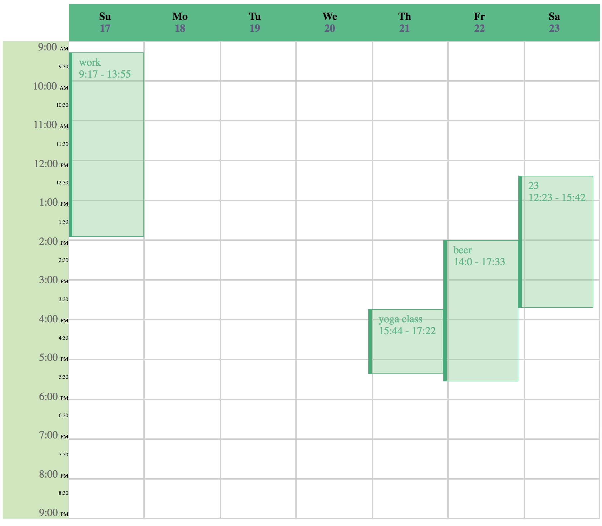

# Event Calendar
This repo generates a event calendar for fun :)

### Screen shot

### Test
`sbt backend/test`

### How to use
1. run dockerized postgres in the project directory `docker-compose -d`
2. run backend `sbt backend/run` and the default port is *9001*
3. compile frontend `sbt frontend/fastOptJS`
4. open `/frontend/index.html` in browser